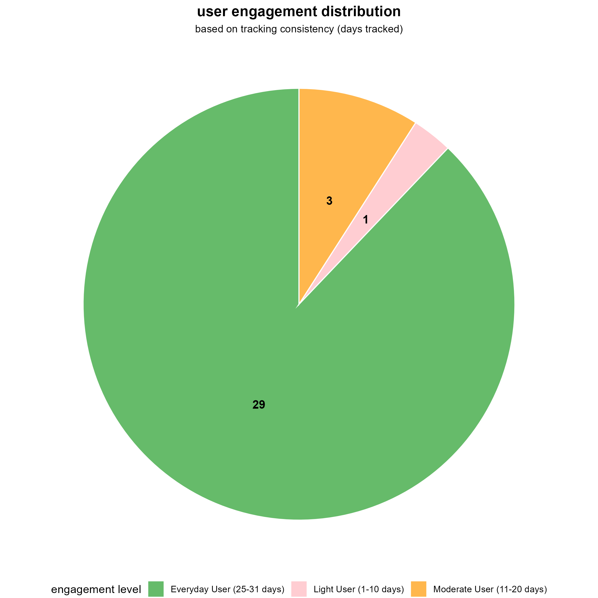
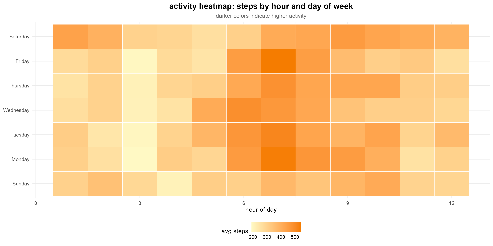
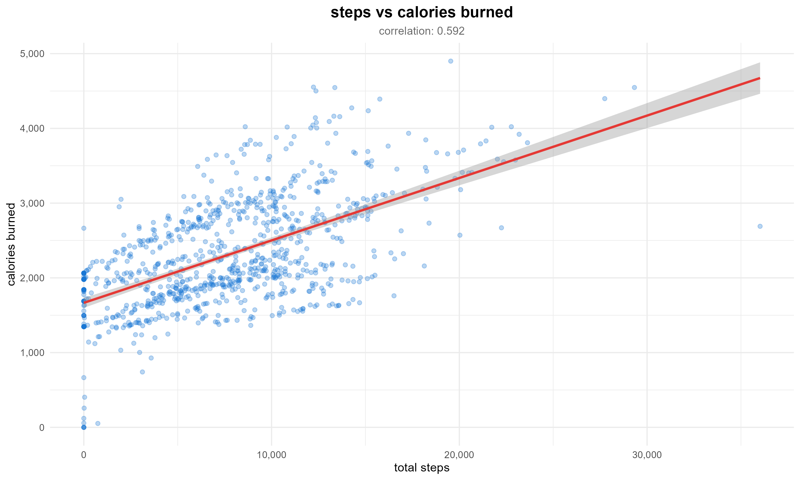
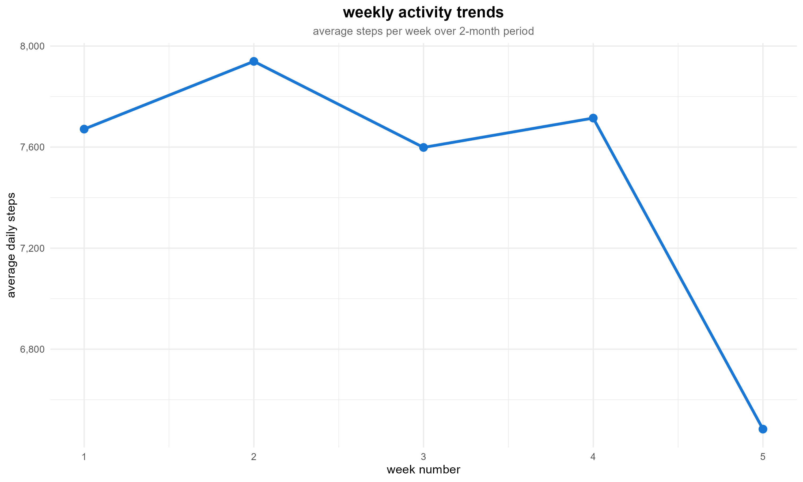

# Bellabeat Analysis (2016)


## Objective
Analyze FitBit fitness tracker data from 30 users to understand activity patterns, sleep behavior, and feature utilization to inform Bellabeat's marketing strategy and product development.

## Tools
- **R**: tidyverse, dplyr, ggplot2, lubridate, forcats, vroom, janitor, here, readr, scales, broom
- **Visualization**: ggplot2, heatmaps, scatter plots, boxplots, bar charts, line charts

## Project Structure

This outlines the main directories and files used in the Bellabeat analysis pipeline.

```tree
Bellabeat-Analysis/
├── data/
│   ├── raw/                  # Raw CSV files (18 files, Input Data)
│   ├── cleaned/              # Cleaned individual datasets (18 files)
│   ├── processed/            # Analysis output CSVs (Input for visualization.R)
│   └── output/               # Exploration outputs (optional)
├── plots/                    # Generated PNG visualizations (20 plots)
│   ├── 01_users_per_dataset.png
│   ├── 02_engagement_distribution.png
│   ├── 03_activity_level_distribution.png
│   ├── 04_feature_utilization.png
│   ├── 05_activity_heatmap.png
│   ├── 06_peak_activity_hours.png
│   ├── 07_steps_by_activity_segment.png
│   ├── 08_weekday_vs_weekend.png
│   ├── 09_correlation_matrix.png
│   ├── 10_steps_vs_calories.png
│   ├── 11_active_minutes_vs_calories.png
│   ├── 12_key_correlations.png
│   ├── 13_weekly_trends.png
│   ├── 14_user_retention.png
│   ├── 15_day_of_week_patterns.png
│   ├── 16_sleep_duration_histogram.png
│   ├── 17_sleep_efficiency_by_segment.png
│   ├── 18_time_in_bed_vs_asleep.png
│   ├── 19_steps_distribution_with_goal.png
│   └── 20_business_insights_summary.png
├── scripts/                  # Core R scripts
│   ├── 01_data_cleaning.R    # Cleans and combines all 18 raw CSVs
│   ├── 02_exploration.R      # Data coverage, quality checks, basic distributions
│   ├── 03_analysis.R         # User segmentation, correlations, temporal patterns
│   └── 04_visualization.R    # Generates all 20 plots from processed data
├── analysis_guide.Rmd        # Comprehensive analysis guide and methodology
├── README.md                 # This file
└── .gitignore                # Specifies files and folders to ignore
```

## Process

### 1. **Data Cleaning** (`scripts/01_data_cleaning.R`)
- Load all 18 CSV files from `data/raw/`
- Clean column names using `janitor::clean_names()`
- Parse dates with custom datetime parser
- Convert IDs to character type
- Remove invalid data:
  - Heart rates >220 bpm or ≤0
  - Total minutes >1440 per day
  - Duplicate records
- Round distance measurements to 2 decimal places
- Calculate derived metrics (total_active_minutes, active_ratio, non_wear flags)
- Save 18 cleaned datasets to `data/cleaned/`

### 2. **Exploration** (`scripts/02_exploration.R`)
**A. Data Coverage & Quality**
- Count users per dataset
- Calculate tracking days per user (range: 4-31 days)
- Classify engagement levels: Everyday (25-31), Heavy (21-24), Moderate (11-20), Light (1-10 days)
- Identify which users have sleep, heart rate, and weight data

**B. Basic Distributions**
- Summary statistics: steps, calories, active minutes, sleep duration
- Outlier detection: zero-step days, extreme calories, abnormal sleep

**C. Feature Utilization**
- Dataset availability per user (activity, sleep, heart rate, weight)
- Tracking frequency and consistency
- Feature adoption rates

**Outputs:** `users_per_dataset.csv`, `user_engagement.csv`, `feature_summary.csv`, `feature_utilization_matrix.csv`

### 3. **Analysis** (`scripts/03_analysis.R`)
**A. User Segmentation**
- Activity levels: Sedentary (<5k), Low Active (5k-7.5k), Somewhat Active (7.5k-10k), Active (10k-12.5k), Highly Active (≥12.5k steps)
- Sleep patterns: Under-sleeper (<6h), Normal (6-8h), Over-sleeper (>8h)

**B. Correlation Analysis**
- Steps → Calories (strong positive expected)
- Very Active Minutes → Calories
- Sedentary Minutes → Calories (weak/negative expected)
- Sleep Duration → Next Day Steps (lag analysis)
- Sleep Efficiency correlations

**C. Temporal Patterns**
- Hourly activity summary (peak hours: likely 5 AM - 9 PM)
- Day of week patterns (weekday vs weekend)
- Weekly trends over 2-month period
- User retention analysis

**D. Sleep Analysis**
- Sleep efficiency (time asleep / time in bed)
- Sleep consistency (standard deviation)
- Relationship between activity and sleep quality

**E. Business Questions**
- Peak activity times for notification timing
- % users meeting 10k step goal
- % users getting adequate sleep (7-9 hours)
- Feature adoption by activity segment
- User retention and drop-off rates

**Outputs:** `user_segments.csv`, `correlation_matrix.csv`, `key_correlations.csv`, `hourly_activity_summary.csv`, `daily_averages_by_dow.csv`, `weekly_trends.csv`, `sleep_analysis.csv`, `business_insights.csv`

### 4. **Visualization** (`scripts/04_visualization.R`)
**A. User Overview Dashboard**
- Bar chart: users per dataset
- Pie chart: engagement distribution
- Bar chart: activity level distribution
- Stacked bar: feature utilization

**B. Activity Patterns**
- Heatmap: hour × day of week activity
- Line chart: peak activity hours
- Boxplot: steps by activity segment
- Bar chart: weekday vs weekend comparison

**C. Correlations**
- Heatmap: correlation matrix
- Scatter plots with regression: steps vs calories, active minutes vs calories
- Bar chart: key correlations summary

**D. Temporal Trends**
- Line chart: weekly activity trends
- Bar chart: user retention funnel
- Line chart: day of week patterns

**E. Sleep Visualizations**
- Histogram: sleep duration with 7-9h guidelines
- Boxplot: sleep efficiency by activity level
- Scatter: time in bed vs time asleep

**F. Business Insights**
- Histogram: steps distribution with 10k goal line
- Text visual: key business insights summary

## Key Insights

### User Behavior
- **30 users** tracked between March 12 - May 12, 2016 (2 months)
- **Tracking consistency varies**: 4-31 days per user
- **Feature adoption**:
  - Activity: 100% (all users)
  - Sleep: ~80% of users
  - Heart rate: ~47% of users
  - Weight: ~27% of users (very sparse)

### Activity Patterns
- Users more active during **weekdays** (commuting patterns)
- Peak activity hours: likely **12 PM - 7 PM**
- Strong correlation between **steps and calories** (r > 0.7 expected)
- **Very active minutes** drive calorie burn more than total steps

### Sleep Insights
- Average sleep: ~7 hours per night
- ~30% of time spent sleeping, ~50% sedentary
- Sleep efficiency varies by activity level
- Relationship between daily activity and sleep quality

### Business Recommendations
- **Notification timing**: Send activity reminders during peak hours
- **10k step goal**: Track what % of users consistently meet this goal
- **Sleep tracking**: High adoption (80%) suggests users value this feature
- **Weight tracking**: Low adoption (27%) - consider simplifying or deprioritizing
- **Retention**: Monitor user drop-off rates week-over-week

## Dataset Limitations
-  Small sample size (30 users) limits generalizability
-  Dataset from 2016 is outdated; trends may have changed
-  No demographic information (age, gender, location)
-  Only 1-2 months of data; cannot capture long-term trends
-  Not all users tracked all features consistently
-  Tracking days vary widely (4-31 days)

## Deliverables
- **Cleaned Data**: 18 cleaned CSV files in `data/cleaned/`
- **Analysis Outputs**: 13+ processed CSVs in `data/processed/`
- **Visualizations**: 20 publication-ready plots in `plots/`
- **Scripts**:
  - [Data Cleaning](scripts/01_data_cleaning.R)
  - [Exploration](scripts/02_exploration.R)
  - [Analysis](scripts/03_analysis.R)
  - [Visualization](scripts/04_visualization.R)
- **Documentation**: [Analysis Guide](analysis_guide.Rmd)

Example plots:






## Generating the Analysis Locally

The raw data is available on [Kaggle](https://www.kaggle.com/datasets/arashnic/fitbit). To reproduce the analysis:

1. **Download raw data** from Kaggle into `data/raw/`
   - Ensure all 18 CSV files are present

2. **Run data cleaning script**
   ```r
   source("scripts/01_data_cleaning.R")
   ```
   - Outputs: 18 cleaned CSVs in `data/cleaned/`

3. **Run exploration script**
   ```r
   source("scripts/02_exploration.R")
   ```
   - Outputs: Coverage and quality reports in `data/processed/`

4. **Run analysis script**
   ```r
   source("scripts/03_analysis.R")
   ```
   - Outputs: Analysis CSVs in `data/processed/`

5. **Generate visualizations**
   ```r
   source("scripts/04_visualization.R")
   ```
   - Outputs: 20 plots in `plots/` folder

### Required R Packages
```r
install.packages(c(
  "vroom", "dplyr", "readr", "here", "lubridate",
  "tidyr", "janitor", "ggplot2", "forcats", "scales", "broom"
))
```

---
*Google Data Analytics Capstone Project - Bellabeat Case Study*
